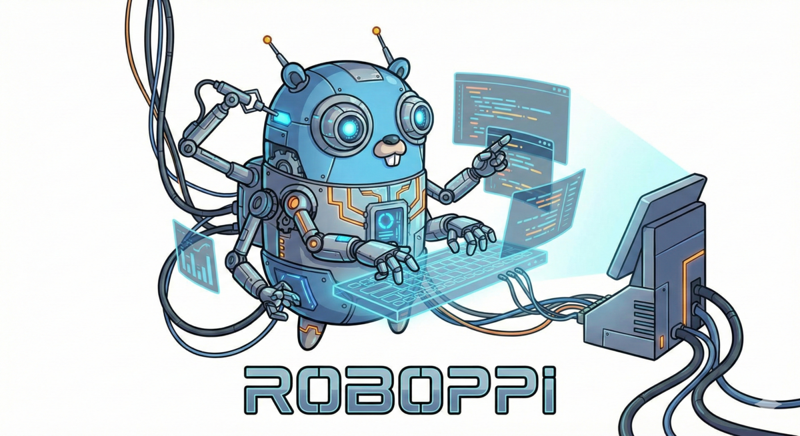

# Roboppi

<p align="center">
  
</p>

English | [日本語](README.ja.md)

Roboppi (ろぼっぴ, pronounced "roh-boh-pee") is an execution-control runtime for agentic workers.

It does not try to be "the agent". It enforces safety invariants around external worker CLIs (OpenCode / Claude Code / Codex CLI / plain shell), so your automation stops when it should, stays within budgets, and leaves a trail you can audit.

Note: the primary CLI/binary name is `roboppi`.
- Compatibility: `agentcore` remains as a legacy alias.
- Env vars/state dirs: prefer `ROBOPPI_` / `.roboppi-loop/` (legacy `AGENTCORE_` / `.agentcore-loop/` are still accepted).

## What Roboppi Can Do (Capabilities)

Execution control (Core runtime):

- Enforce hard budgets: timeouts, max attempts, concurrency, RPS, optional cost caps
- End-to-end cancellation: Job -> Permit -> Worker via AbortSignal (best-effort SIGTERM -> SIGKILL)
- Failure containment: circuit breakers + backpressure responses under overload
- Process isolation: delegate heavy work to separate worker processes (limit blast radius)
- Auditability: structured logs + artifacts (stdout/stderr summaries, diffs/patches, executed commands, timings)

Workflow orchestration (YAML):

- Run multi-step DAG workflows (`depends_on`) with optional parallelism (`concurrency`)
- Pass files between steps with declared `outputs`/`inputs` via a `context/` directory
- Automatic step retries and failure policy (`retry` / `continue` / `abort`)
- Loop until complete with `completion_check` + `max_iterations`
- Optional convergence guard for loops: stall detection + scope/diff budgets (`allowed_paths`, `max_changed_files`)

Automation (Daemon mode):

- Run workflows on interval/cron/fswatch/webhook/command events
- Optional evaluate/analyze gates (run LLM work only when conditions are met)
- Supervised execution: Supervisor -> Core -> Worker process tree via IPC (socket-based transport available)

Repo safety (git workspaces):

- Deterministic base branch resolution (records base commit SHA)
- Branch Lock drift detection (fail-fast before a step runs)
- Protected-branch guard to avoid direct edits on `main` (override must be explicit)

Extensibility:

- Add worker adapters behind a unified `WorkerAdapter` interface
- Reusable agent profiles via agent catalogs (`agents.yaml`) referenced by `step.agent`

Scheduling (reference implementation):

- Prioritized job queue (interactive vs batch)
- Deduplication via idempotency keys (`coalesce` / `latest-wins` / `reject`)
- Retry policy (exponential backoff + jitter) + DLQ storage
- Supervisor that launches/monitors the Core process (crash/hang handling)

## Architecture (High Level)

Roboppi is designed as a 3-layer system:

```
Supervisor / Runner (policy, parent process)
  -> Core (mechanism, child process)
      -> Worker processes (external CLIs)
```

- Core owns safety invariants (permits, budgets, cancellation, cutoffs).
- Policy (ordering, retries, dedup strategy) stays swappable at the supervisor/runner level.
- Core and supervisor communicate over JSON Lines IPC.

Design docs:

- `docs/design.md`
- `docs/guide/architecture.md`

## Install

Prerequisites:

- Bun (CI uses Bun 1.3.8)

Optional worker CLIs (depending on what you want to delegate to):

- OpenCode: `opencode`
- Claude Code: `claude`
- Codex CLI: `codex`
- Optional (PR creation in demos): `gh`

Install dependencies:

```bash
bun install
```

Build the binary (optional):

```bash
make build
./roboppi --help
./roboppi workflow --help
./roboppi daemon --help
```

## Quickstart

### 0) IPC server mode (`roboppi`)

Start a JSON Lines IPC server (reads stdin, writes stdout; logs go to stderr):

```bash
./roboppi
```

If you are building your own Supervisor/Scheduler, this is the Core process you talk to.

### 1) One-shot worker task (`roboppi run`)

`roboppi run` delegates a single task to a worker with a strict timeout/budget.

```bash
# One-shot: have OpenCode create files
./roboppi run --worker opencode --workspace /tmp/demo \
  --capabilities READ,EDIT --timeout 60000 \
  "Write a README for this repo"
```

### 2) Run a workflow YAML

Workflows are executed by the workflow runner.

```bash
./roboppi workflow examples/hello-world.yaml --verbose
# (dev) bun run src/workflow/run.ts examples/hello-world.yaml --verbose
```

By default, workflows run in supervised mode (Supervisor -> Core -> Worker).
Use `--direct` to spawn workers directly from the runner (no Core IPC).

```bash
ROBOPPI_VERBOSE=1 bun run src/workflow/run.ts examples/agent-pr-loop.yaml \
  --workspace /tmp/my-work --verbose
```

Docs:

- `docs/guide/workflow.md`
- `docs/workflow-design.md`

### 3) Run daemon mode (resident workflows)

```bash
./roboppi daemon examples/daemon/agent-pr-loop.yaml --verbose
# (dev) bun run src/daemon/cli.ts examples/daemon/agent-pr-loop.yaml --verbose
```

Docs:

- `docs/guide/daemon.md`

### 4) Agent PR Loop demo

The demo creates a scratch git repo under `/tmp/` and runs the full loop:

`design -> todo -> (implement <-> review/fix)* -> (optional) create_pr`

```bash
bash examples/agent-pr-loop-demo/run-in-tmp.sh
```

To enable PR creation in the demo, create the marker file in the target repo:

```bash
touch "/path/to/target/.roboppi-loop/enable_pr"
```

Run the PR loop against your own repo (recommended: run from this repo, target another workspace):

```bash
ROBOPPI_ROOT=/path/to/roboppi
TARGET=/path/to/your/repo

mkdir -p "$TARGET/.roboppi-loop"
$EDITOR "$TARGET/.roboppi-loop/request.md"

ROBOPPI_ROOT="$ROBOPPI_ROOT" bun run --cwd "$ROBOPPI_ROOT" src/workflow/run.ts \
  "$ROBOPPI_ROOT/examples/agent-pr-loop.yaml" \
  --workspace "$TARGET" --verbose
```

Notes:

- The workflow writes state/artifacts under `.roboppi-loop/` and `context/` inside the target workspace (typically gitignored; legacy `.agentcore-loop/` is still accepted).
- PR creation is opt-in via `.roboppi-loop/enable_pr`.

## Workflow YAML At A Glance

Minimal example:

```yaml
name: build-test
version: "1"
timeout: "10m"

steps:
  build:
    worker: CUSTOM
    instructions: "make build"
    capabilities: [RUN_COMMANDS]

  test:
    depends_on: [build]
    worker: CUSTOM
    instructions: "make test"
    capabilities: [RUN_TESTS]
```

For loops:

- use `completion_check` + `max_iterations`
- prefer `decision_file` for deterministic COMPLETE/INCOMPLETE decisions

See `docs/guide/workflow.md` for the full schema.

## Agent Catalogs (Reusable Agent Profiles)

If you repeat the same worker/model/capabilities/base-instructions across steps, define an agent catalog:

```yaml
version: "1"
agents:
  research:
    worker: OPENCODE
    model: openai/gpt-5.2
    capabilities: [READ]
    base_instructions: |
      You are a research agent.
      - Only read files. Do not edit.
```

Then reference it from workflow steps:

```yaml
steps:
  investigate:
    agent: research
    instructions: "Investigate the codebase and write notes."
```

Docs:

- `docs/guides/agents.md`
- `docs/guides/agents.ja.md`

## Branch Safety (Git Workspaces)

For workflows that operate on git repos, Roboppi provides base-branch resolution, Branch Lock drift detection, and protected-branch guards.

Useful flags:

- `--base-branch <name>` (overrides `BASE_BRANCH`)
- `--protected-branches <csv>` (default: `main,master,release/*`)
- `--allow-protected-branch` (dangerous; explicit override)

Docs:

- `docs/guides/branch.md`
- `docs/guides/branch.ja.md`

## Supervised IPC Transport (For `--supervised`)

Workflows/daemon run supervised by default. In supervised mode, the runner starts a Core child process and delegates steps over IPC.

- Default: interactive runs typically use stdio; non-interactive runs default to a socket transport.
- Override transport: `AGENTCORE_SUPERVISED_IPC_TRANSPORT=stdio|socket|tcp`
- Debug IPC: `AGENTCORE_IPC_TRACE=1`
- Tune request timeouts: `AGENTCORE_IPC_REQUEST_TIMEOUT=2m` (or `AGENTCORE_IPC_REQUEST_TIMEOUT_MS=120000`)

Disable supervised mode:

- Workflow runner: `--direct`
- Daemon CLI: `--direct`

## Documentation

- `docs/guide/quickstart.md`
- `docs/guide/workflow.md`
- `docs/guide/daemon.md`
- `docs/guide/architecture.md`
- `docs/design.md`
- `docs/guides/agents.md`
- `docs/guides/branch.md`

## Development

```bash
make typecheck
make test
make test-all
```

## Status

This project is still evolving and APIs/behavior may change. The design intent is stable (mechanism/policy separation + permits + process isolation); the surface area (CLI flags, YAML schema) may continue to iterate.
